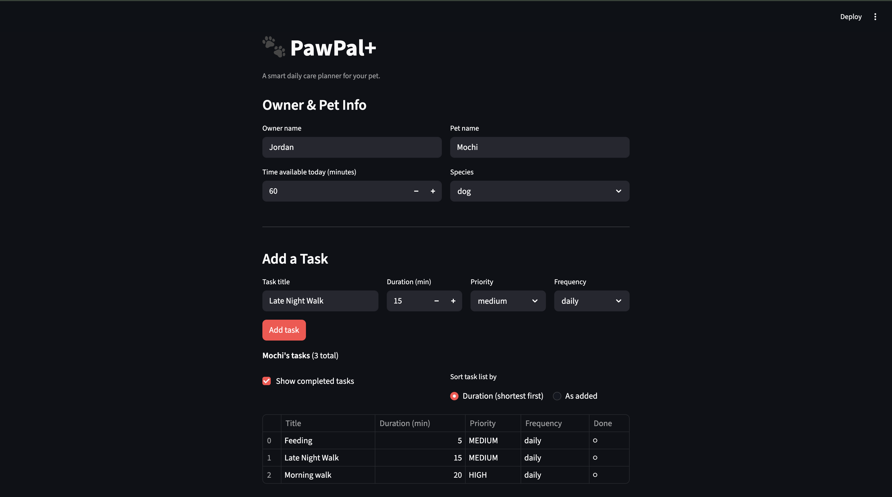
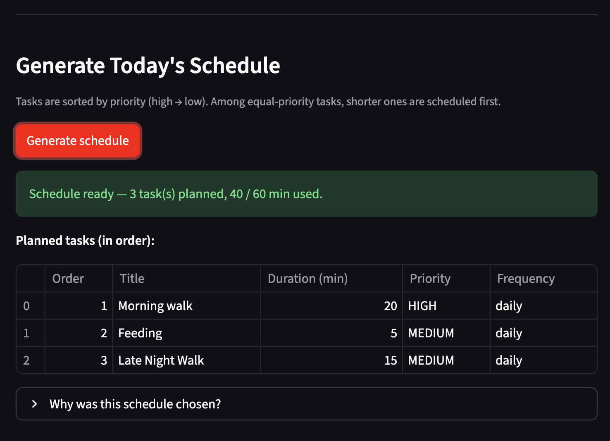

# 🐾 PawPal+

**PawPal+** is a smart daily care planner for pet owners. Tell it about your pet, add care tasks with priorities and durations, and it generates an optimized daily schedule — explaining every decision it makes.

Built with Python + Streamlit as a Module 2 project for CodePath AI110.

---

## 📸 Demo

<a href="/course_images/ai110/your_screenshot_name.png" target="_blank"></a>
<a href="/course_images/ai110/your_screenshot_name.png" target="_blank"></a>

---

## ✨ Features

### Smart Scheduling
- **Priority-first scheduling** — Tasks are ranked high → medium → low. The scheduler greedily fits tasks into the owner's daily time budget, starting from the most important.
- **Duration tiebreaker** — When two tasks share the same priority, the shorter one is scheduled first. This maximizes the number of tasks that fit within the budget.
- **Reasoning output** — Every generated schedule explains in plain English which tasks were included, which were skipped, and why.

### Recurring Tasks
- **Daily recurrence** — Completing a daily task automatically creates the next occurrence for tomorrow (`due_date + 1 day`).
- **Weekly recurrence** — Completing a weekly task schedules the next one for 7 days out.
- **As-needed tasks** — Completing a one-off task closes it permanently with no new occurrence created.

### Filtering & Sorting
- **Filter by completion** — View only pending tasks or all tasks including completed ones.
- **Sort by duration** — Re-order the task list shortest-to-longest for quick scanning.
- **Filter by pet** — In multi-pet households, retrieve tasks belonging to a specific pet by name.

### Conflict Detection
- **Duplicate task warning** — If the same task title appears more than once for a pet on the same day, the scheduler flags it before presenting the schedule.
- **Impossible task warning** — If a task's duration exceeds the owner's total time budget, the scheduler warns that it can never be scheduled rather than silently skipping it every time.
- **Non-crashing** — All warnings are returned as human-readable strings; the scheduler always produces a schedule even when conflicts exist.

---

## 🗂 Project Structure

```
pawpal_system.py   # Logic layer: Task, Pet, Owner, Scheduler, Schedule
app.py             # Streamlit UI
tests/
  test_pawpal.py   # 20 automated tests
main.py            # Terminal demo script
uml_final.png      # Final system architecture diagram
reflection.md      # Design decisions and project reflection
```

---

## 🚀 Getting Started

### Setup

```bash
python -m venv .venv
source .venv/bin/activate   # Windows: .venv\Scripts\activate
pip install -r requirements.txt
```

### Run the app

```bash
streamlit run app.py
```

### Run the terminal demo

```bash
python main.py
```

---

## 🧪 Testing PawPal+

### Run the tests

```bash
python -m pytest tests/ -v
```

### What the tests cover

The suite contains **20 tests** across five categories:

| Category | Tests | What is verified |
|---|---|---|
| **Core behavior** | 4 | `mark_complete()` flips status; `add_task()` grows the list; scheduler orders high → medium → low; tasks too long are skipped |
| **Sorting** | 2 | Equal-priority tasks are ordered shortest-first (tiebreaker); `sort_by_duration()` returns ascending order independently |
| **Recurrence** | 4 | Daily → `+1 day`; weekly → `+7 days`; as-needed → `None`; completing through Scheduler adds exactly one new pending task |
| **Conflict detection** | 3 | Duplicate titles fire a warning; impossible tasks fire a warning; a clean list produces zero warnings |
| **Edge cases** | 4 | Pet with no tasks, owner with no pets, all tasks completed — empty schedules without crashing; task that exactly fills budget is planned not skipped |

### Confidence level

★★★★☆ (4 / 5)

Core scheduling logic is fully covered. The one-star gap reflects two known, documented tradeoffs: no automated UI tests (requires browser interaction), and conflict detection uses exact string matching so semantically duplicate tasks with different titles are not caught.

---

## 🏗 System Architecture

The final UML diagram is saved as [uml_final.png](uml_final.png).

Five classes make up the logic layer:

| Class | Role |
|---|---|
| `Task` | Single care activity — title, duration, priority, frequency, due date |
| `Pet` | Owns a list of tasks; handles task completion and recurrence |
| `Owner` | Owns a list of pets; aggregates all tasks across pets |
| `Scheduler` | Coordinates scheduling, sorting, filtering, and conflict detection |
| `Schedule` | Output object holding planned tasks, skipped tasks, reasoning, and conflict warnings |

---

## 🔄 Suggested Development Workflow

1. Read the scenario carefully and identify requirements and edge cases.
2. Draft a UML diagram (classes, attributes, methods, relationships).
3. Convert UML into Python class stubs (no logic yet).
4. Implement scheduling logic in small increments.
5. Add tests to verify key behaviors.
6. Connect your logic to the Streamlit UI in `app.py`.
7. Refine UML so it matches what you actually built.
