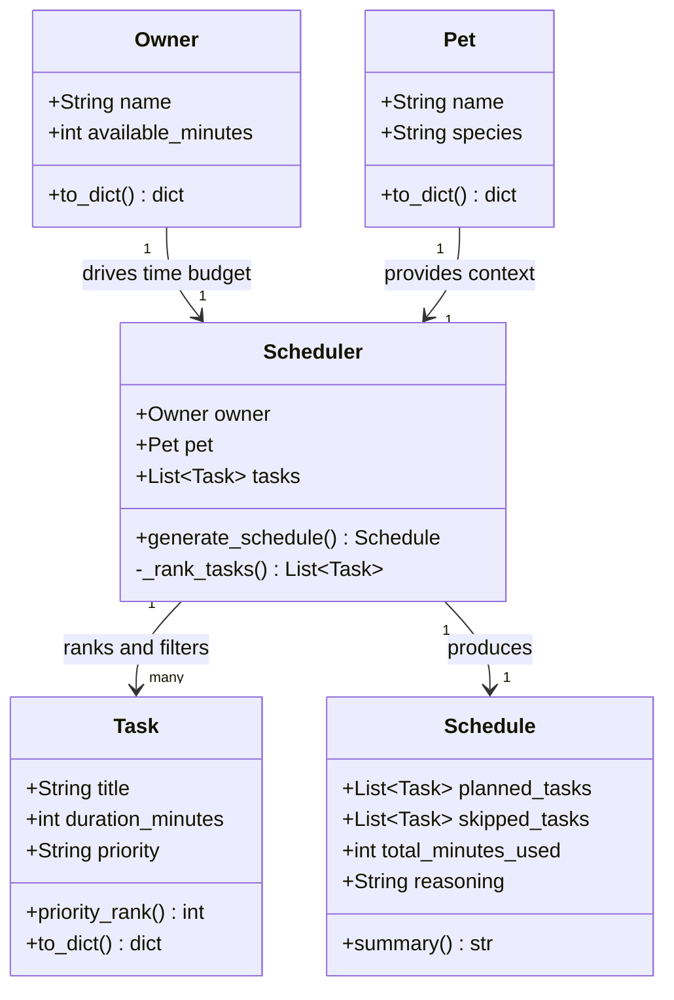
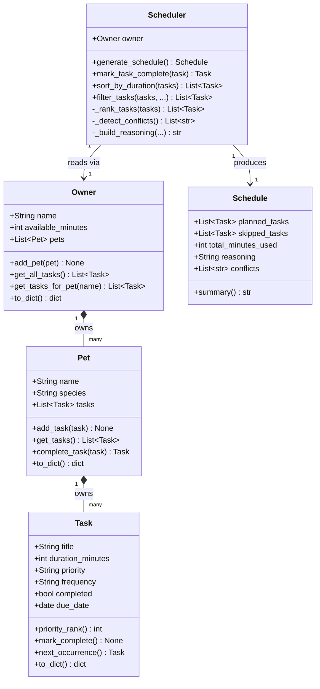

# PawPal+ Project Reflection

## 1. System Design

**a. Initial design**

**Core user actions:**

1. **Add and describe their pet** — The user enters basic information about their pet (name and species). This gives the scheduler the context it needs to tailor a care plan, since a dog's needs differ from a cat's.

2. **Build a task list with priorities and durations** — The user adds care tasks (e.g., morning walk, feeding, medication, grooming) and for each task specifies how long it takes and how important it is (low / medium / high priority). This is the raw input the scheduler uses to make decisions.

3. **Generate and review a daily schedule** — The user triggers the scheduler, which arranges the tasks into a realistic daily plan that fits within available time. The app displays the ordered schedule and explains why tasks were included, ordered, or skipped — so the user understands the reasoning, not just the output.

**UML Class Diagram (Mermaid):**

**Initial UML (Phase 1 draft):**

**Final UML (matches pawpal_system.py):**

The design has five classes. `Pet` and `Owner` are pure data holders — `Pet` stores name and species, `Owner` stores name and the day's time budget in minutes. `Task` holds a single care activity (title, duration, priority) and knows how to convert its priority string to a sortable integer via `priority_rank()`. `Scheduler` is the coordinator: it receives an `Owner`, a `Pet`, and a list of `Tasks`, then produces a `Schedule` by sorting tasks by priority and fitting them within the owner's available time. `Schedule` is the output object — it separates planned tasks from skipped ones, tracks total minutes used, and holds a human-readable reasoning string explaining the decisions made.

**b. Design changes**

During review of the skeleton, a logic bottleneck was identified in `Task.priority_rank()`: the priority string ("low", "medium", "high") needed to be mapped to an integer for sorting, but if an invalid or unexpected value was passed (e.g., "urgent"), the method had no fallback and would silently return `None`, breaking the sort. To fix this, a module-level `PRIORITY_MAP` constant (`{"low": 1, "medium": 2, "high": 3}`) was extracted and `priority_rank()` was implemented as `PRIORITY_MAP.get(self.priority, 0)`. This centralizes the ranking logic in one place, makes it easy to extend later, and ensures unknown priorities degrade gracefully to rank 0 (sorted last) rather than crashing.

---

## 2. Scheduling Logic and Tradeoffs

**a. Constraints and priorities**

The scheduler considers four constraints, in order of weight:

1. **Time budget** (`available_minutes`) — a hard ceiling. No task can be scheduled if it would push total time over the limit. This is the most fundamental constraint because it reflects a real-world reality: the owner has a fixed amount of time in the day.

2. **Priority** (`high` / `medium` / `low`) — the owner's expressed preference. The scheduler always attempts higher-priority tasks before lower ones, even if that means lower total utilization of the time budget.

3. **Duration** — used as a tiebreaker within the same priority level. Among equally important tasks, shorter ones are scheduled first to maximize the number of tasks that fit.

4. **Completion status** — completed tasks are excluded entirely from scheduling. This prevents already-done work from appearing in the day's plan.

Time was placed above priority intentionally: a task cannot be "important enough to ignore physics." Priority sits above duration because it represents the owner's values — it would be wrong to schedule a low-priority grooming session before a high-priority medication just because grooming is shorter. Duration as a tiebreaker was a deliberate design choice, not a default; without it, equal-priority tasks would be ordered by insertion sequence, which is arbitrary.

**b. Tradeoffs**

The scheduler uses a **greedy algorithm**: it sorts tasks by priority (with duration as a tiebreaker) and adds each one to the plan if it fits in the remaining time budget, skipping it permanently if it does not. This means the scheduler can leave available time unused. For example, if the budget is 25 minutes and there is one 20-minute HIGH task and two 10-minute MEDIUM tasks, the greedy approach picks the 20-minute task (leaving 5 minutes idle) rather than the two 10-minute tasks (which would use 20 minutes and complete more tasks). The optimal solution — maximizing the number of tasks completed within the budget — is a variant of the 0/1 knapsack problem and is NP-hard.

This tradeoff is reasonable for a pet care app for two reasons. First, greedy scheduling respects priority intent: if a walk is HIGH priority, it should always be attempted before lower-priority tasks, even if that means less overall utilization. Second, the time budgets in this domain (60–120 minutes) and task counts (5–15 items) are small enough that the greedy approach almost never leaves significant time on the table in practice. Implementing a full knapsack solver would add complexity with no meaningful benefit for the target user.

A second tradeoff appears in conflict detection: duplicate task detection uses exact (case-insensitive) title matching. "Morning walk" and "Walk Mochi" would not be caught as duplicates even if they represent the same activity. Fuzzy matching was considered but rejected because it would produce false positives (e.g., flagging "Brush fur" and "Brush teeth" as duplicates) without a clear threshold to tune.

---

## 3. AI Collaboration

**a. How you used AI**

AI was used across every phase of this project, with a different mode for each:

- **Design brainstorming** — prompting "what attributes and methods should each class own?" helped surface `frequency` and `due_date` as Task fields early, before they were needed for recurrence. Without that conversation, those fields would have been added as an afterthought and required a more disruptive refactor.
- **Skeleton generation** — asking for Python dataclass stubs produced clean, idiomatic scaffolding (including the `field(default_factory=list)` pattern for mutable defaults) faster than writing boilerplate by hand.
- **Code review** — the prompt "review this skeleton for missing relationships or logic bottlenecks" caught the `priority_rank()` silent-failure problem before any implementation was written. Asking "how could this algorithm be simplified?" surfaced the `collections.Counter` refactor for `_detect_conflicts`.
- **Test planning** — asking "what are the most important edge cases for a scheduler with sorting and recurring tasks?" produced a structured list that became the 13-test gap analysis, catching cases like "task that exactly fills budget" that would have been easy to overlook.
- **UI patterns** — asking about `st.session_state` and how to persist objects across Streamlit re-runs was the most practically useful single answer of the project.

The most effective prompt structure throughout was: **give AI the specific file or function as context, then ask a focused question** rather than a broad one. "Based on `_detect_conflicts`, how could this be simplified?" consistently produced better output than "how do I detect duplicates in Python?"

**b. Judgment and verification**

The clearest moment of rejection came with the `Scheduler` constructor. The original skeleton was `Scheduler(owner, pet, tasks)` — AI generated this and, if left unchallenged, would have kept it. Before writing any logic, I rejected that signature in favor of `Scheduler(owner)` only, on the grounds that `Pet` and the task list are both reachable through `Owner`. Passing them separately would have meant the caller was responsible for keeping three arguments in sync, and any future support for multiple pets would have required changing the constructor signature.

To verify the decision was correct, I traced the data flow: `Scheduler.generate_schedule()` calls `owner.get_all_tasks()` which calls `pet.get_tasks()` for each pet. The `Scheduler` never needs to know about individual pets directly. The simpler interface was also confirmed by the test suite — every test creates only `Scheduler(owner=owner)` and the tests are clean and readable as a result.

A second moment: when AI suggested collapsing `_detect_conflicts` into a dense one-liner using nested generators, I kept the two-loop version because the two conflict types (duplicate titles vs. impossible durations) are conceptually different checks that deserve to be readable as separate blocks.

---

## 4. Testing and Verification

**a. What you tested**

The suite covers 20 behaviors across five categories:

- **Core behavior** — `mark_complete()` status flip, `add_task()` count growth, priority ordering (high → medium → low), budget enforcement (tasks that don't fit land in `skipped_tasks`). These were the first four tests written and serve as a sanity check that the basic contracts of every class hold.
- **Sorting** — the duration tiebreaker (shorter HIGH task scheduled before longer HIGH task) and `sort_by_duration()` as a standalone utility. These matter because sorting is the invisible engine behind every schedule; a bug here affects every output.
- **Recurrence** — daily `+1 day`, weekly `+7 days`, as-needed `→ None`, and the full chain through `Scheduler.mark_task_complete()`. Recurrence is stateful: it mutates the pet's task list, so testing the count before and after is essential.
- **Conflict detection** — duplicate title fires, impossible task fires, clean list produces no warnings. The "no false positives" test is as important as the positive cases.
- **Edge cases** — pet with no tasks, owner with no pets, all tasks already completed, task that exactly equals `available_minutes`. These test the boundaries of the greedy loop (`<=` vs `<`) and the empty-input guards.

Tests were written for behaviors rather than implementations — each test asserts *what* should happen, not *how* the code achieves it. This means the tests remained valid across every refactor.

**b. Confidence**

★★★★☆ (4 / 5). The scheduling contract is well-covered: 20 tests, all passing, zero flaky behavior observed across multiple runs.

The remaining gap is in two areas. First, the Streamlit UI has no automated tests — interactions like clicking "Add task" or "Generate schedule" can only be verified manually. Second, the recurrence system has no test for the interaction between `filter_tasks` and recurring tasks (e.g., confirming that a newly created next-occurrence task appears correctly in a filtered view). If time permitted, the next tests would be:

- Scheduling a mix of recurring and non-recurring tasks and verifying only the non-recurring ones disappear after completion
- `available_minutes = 0` (zero budget — should produce empty planned list without crashing)
- Multi-pet `filter_tasks` interaction (tasks from pet A must not appear in a filter for pet B even when both pets are in session state)

---

## 5. Reflection

**a. What went well**

The layer separation is the part of this project I'm most satisfied with. Each class has a single, clear responsibility: `Task` knows about itself, `Pet` owns its tasks, `Owner` aggregates across pets, `Scheduler` coordinates without micromanaging. This paid dividends when recurring tasks were added — a significant feature that required adding `frequency`, `due_date`, `mark_complete()`, and `next_occurrence()` to `Task`, and `complete_task()` to `Pet`. The `Scheduler` required almost no changes: it just called `pet.complete_task(task)` and let `Pet` handle the rest. A tightly coupled design would have required rewriting the scheduler's core loop.

The `Scheduler(owner)` interface was also a good decision. Every feature added after the initial design — filtering, sorting, recurrence, conflict detection — worked cleanly through the single `owner` entry point without requiring new constructor parameters.

**b. What you would improve**

Two things stand out for a second iteration:

First, **explicit time slots**. Tasks currently have a `due_date` but no start/end time. Conflict detection can only catch duplicate titles, not true scheduling conflicts (e.g., two 30-minute tasks both scheduled for 8am). Adding a `start_time` field to `Task` and assigning sequential start times in `generate_schedule()` would make conflict detection meaningful in the real sense of the word and would let `Schedule.summary()` display a proper timed agenda.

Second, **data persistence**. All state is held in `st.session_state`, which is cleared on browser refresh and never saved. A real pet care app needs the task list and completion history to survive between sessions. Adding a lightweight JSON file export/import or SQLite backend would make the app usable beyond a single demo session.

**c. Key takeaway**

The most important thing I learned is that **AI is a fast executor, not a careful architect**. Given a prompt, it produces working code quickly — but it defaults to the path of least resistance and rarely pushes back on a design decision that is technically valid but architecturally poor. The `Scheduler(owner, pet, tasks)` constructor is the clearest example: AI generated it, it worked, and it would have stayed forever without a human asking "why does the caller need to pass data that's already reachable through `owner`?"

Being the "lead architect" in an AI-assisted workflow means holding the system's design intent in your head and using that intent as a filter. Every AI suggestion should be evaluated against the question: "does this fit the design, or does it just solve the immediate problem?" When those two things conflict, the human has to choose — and the human is the only one in the collaboration who can.

Keeping separate chat sessions for different phases (design, implementation, testing, UI) also made a concrete difference. A session that has been used for 30 minutes of sorting-algorithm discussion will generate different (and worse) answers to a question about Streamlit session state than a fresh session asked the same question with clean context. Context management is a real skill when working with AI tools.
