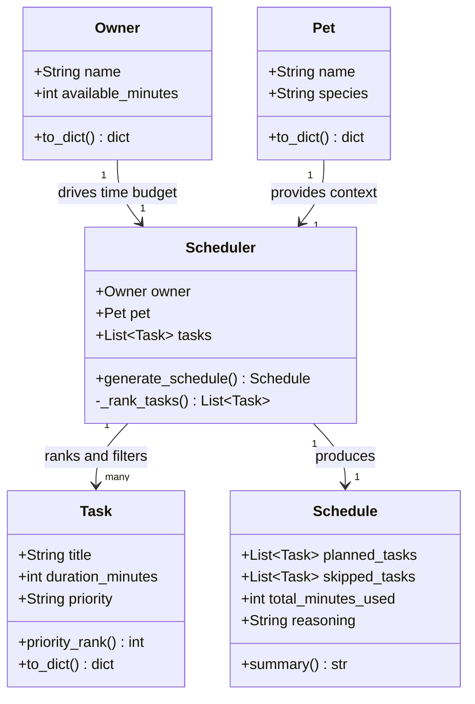
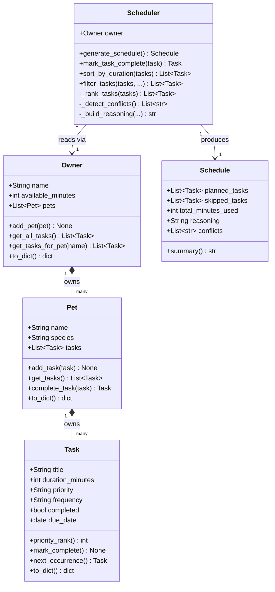

# PawPal+ Project Reflection

## 1. System Design

**a. Initial design**

**Core user actions:**

1. **Add and describe their pet** — The user enters basic information about their pet (name and species). This gives the scheduler the context it needs to tailor a care plan, since a dog's needs differ from a cat's.

2. **Build a task list with priorities and durations** — The user adds care tasks (e.g., morning walk, feeding, medication, grooming) and for each task specifies how long it takes and how important it is (low / medium / high priority). This is the raw input the scheduler uses to make decisions.

3. **Generate and review a daily schedule** — The user triggers the scheduler, which arranges the tasks into a realistic daily plan that fits within available time. The app displays the ordered schedule and explains why tasks were included, ordered, or skipped — so the user understands the reasoning, not just the output.

**UML Class Diagram (Mermaid):**

**Initial UML (Phase 1 draft):**

**Final UML (matches pawpal_system.py):**

The design has five classes. `Pet` and `Owner` are pure data holders — `Pet` stores name and species, `Owner` stores name and the day's time budget in minutes. `Task` holds a single care activity (title, duration, priority) and knows how to convert its priority string to a sortable integer via `priority_rank()`. `Scheduler` is the coordinator: it receives an `Owner`, a `Pet`, and a list of `Tasks`, then produces a `Schedule` by sorting tasks by priority and fitting them within the owner's available time. `Schedule` is the output object — it separates planned tasks from skipped ones, tracks total minutes used, and holds a human-readable reasoning string explaining the decisions made.

**b. Design changes**

During review of the skeleton, a logic bottleneck was identified in `Task.priority_rank()`: the priority string ("low", "medium", "high") needed to be mapped to an integer for sorting, but if an invalid or unexpected value was passed (e.g., "urgent"), the method had no fallback and would silently return `None`, breaking the sort. To fix this, a module-level `PRIORITY_MAP` constant (`{"low": 1, "medium": 2, "high": 3}`) was extracted and `priority_rank()` was implemented as `PRIORITY_MAP.get(self.priority, 0)`. This centralizes the ranking logic in one place, makes it easy to extend later, and ensures unknown priorities degrade gracefully to rank 0 (sorted last) rather than crashing.

---

## 2. Scheduling Logic and Tradeoffs

**a. Constraints and priorities**

- What constraints does your scheduler consider (for example: time, priority, preferences)?
- How did you decide which constraints mattered most?

**b. Tradeoffs**

The scheduler uses a **greedy algorithm**: it sorts tasks by priority (with duration as a tiebreaker) and adds each one to the plan if it fits in the remaining time budget, skipping it permanently if it does not. This means the scheduler can leave available time unused. For example, if the budget is 25 minutes and there is one 20-minute HIGH task and two 10-minute MEDIUM tasks, the greedy approach picks the 20-minute task (leaving 5 minutes idle) rather than the two 10-minute tasks (which would use 20 minutes and complete more tasks). The optimal solution — maximizing the number of tasks completed within the budget — is a variant of the 0/1 knapsack problem and is NP-hard.

This tradeoff is reasonable for a pet care app for two reasons. First, greedy scheduling respects priority intent: if a walk is HIGH priority, it should always be attempted before lower-priority tasks, even if that means less overall utilization. Second, the time budgets in this domain (60–120 minutes) and task counts (5–15 items) are small enough that the greedy approach almost never leaves significant time on the table in practice. Implementing a full knapsack solver would add complexity with no meaningful benefit for the target user.

A second tradeoff appears in conflict detection: duplicate task detection uses exact (case-insensitive) title matching. "Morning walk" and "Walk Mochi" would not be caught as duplicates even if they represent the same activity. Fuzzy matching was considered but rejected because it would produce false positives (e.g., flagging "Brush fur" and "Brush teeth" as duplicates) without a clear threshold to tune.

---

## 3. AI Collaboration

**a. How you used AI**

- How did you use AI tools during this project (for example: design brainstorming, debugging, refactoring)?
- What kinds of prompts or questions were most helpful?

**b. Judgment and verification**

- Describe one moment where you did not accept an AI suggestion as-is.
- How did you evaluate or verify what the AI suggested?

---

## 4. Testing and Verification

**a. What you tested**

- What behaviors did you test?
- Why were these tests important?

**b. Confidence**

- How confident are you that your scheduler works correctly?
- What edge cases would you test next if you had more time?

---

## 5. Reflection

**a. What went well**

- What part of this project are you most satisfied with?

**b. What you would improve**

- If you had another iteration, what would you improve or redesign?

**c. Key takeaway**

- What is one important thing you learned about designing systems or working with AI on this project?
